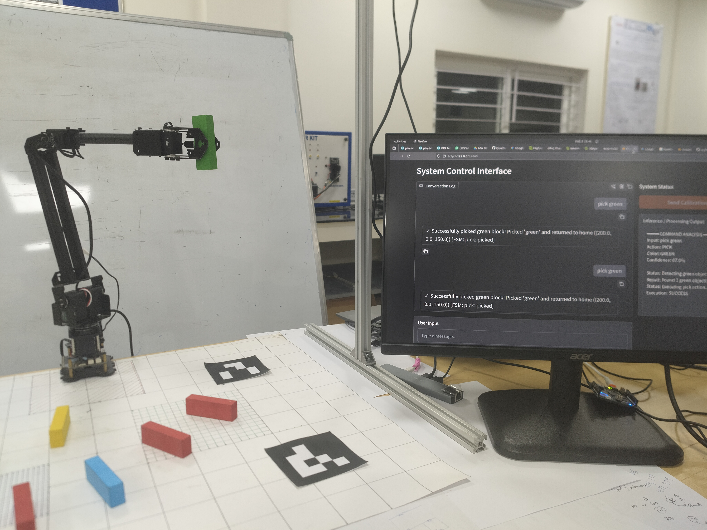

# The Semantic Manipulator

**Natural language-controlled robotic manipulation of colored blocks using monocular vision, lightweight semantic parsing, and finite state machine grounding.**



---

## Overview

The Semantic Manipulator is a real-time system that allows a user to control a 4-DOF robotic arm through conversational commands such as *"pick up the red block"* or *"drop it."* The system handles the full pipeline from free-form text to physical actuation without requiring the operator to know anything about joint-space kinematics, coordinate transforms, or robot programming.

The architecture follows a strict **Sense-Think-Act** loop. A monocular vision pipeline segments colored blocks via HSV thresholding and localizes them in the robot's coordinate frame using an ArUco-based homography. A lightweight text classifier (**model2vec** + **Logistic Regression**) parses natural language into one of four deterministic action primitives. A **finite state machine** validates every parsed command against the robot's current physical state before any motor movement is authorized.

A core design constraint is that natural language *informs* the action but never *directly controls* the actuators. The FSM grounding layer is the sole authority over motor commands, ensuring that classifier misclassifications or out-of-distribution inputs cannot produce unsafe behavior. The entire system runs locally on a single machine with no cloud APIs and no GPU.

---

## System Architecture

| Stage | Module(s) | Responsibility |
|-------|-----------|----------------|
| **Sense** | `src/detect_jenga.py`, `src/colour_coordinates.py` | HSV color segmentation, contour analysis, pinhole depth estimation, homography transform to robot frame |
| **Think** | `src/text_classifier.py`, `src/fsm_controller.py` | Intent classification (pick / place / drop / none), color extraction, state validation |
| **Act** | `src/roarm_m2/actions/` | Cartesian motion sequences via JSON-over-HTTP, gripper control, motion completion detection |
| **Interface** | `src/homepage.py` | Gradio web console with chat mode and teleop controls |


---

## Hardware Requirements

| Component | Model | Role |
|-----------|-------|------|
| Robotic Arm | RoArm-M2 (4-DOF) | Manipulation and gripper actuation; controlled via JSON-over-HTTP (WiFi) |
| Camera | Intel RealSense D435 | RGB frame capture and calibrated intrinsics (depth stream not used) |
| Camera Mount | Overhead rig (~78.5 cm above workspace) | Fixed top-down view of the workspace |
| Workspace Surface | Flat, uniform background | Contrast surface for colored block segmentation |
| Colored Blocks | Standard Jenga blocks (7.0 x 2.5 x 1.5 cm) | Manipulation targets; six supported colors (red, orange, yellow, green, blue, pink) |
| Host Machine | Any machine with USB 3.0 and WiFi | Runs the full pipeline; no GPU required |

---

## Software Dependencies

| Library / Framework | Role |
|---------------------|------|
| [OpenCV](https://opencv.org/) (`opencv-python`) | Color segmentation, contour detection, ArUco marker detection, homography computation |
| [model2vec](https://github.com/MinishLab/model2vec) | Lightweight static sentence embeddings (`potion-base-8M`, 8M params) |
| [scikit-learn](https://scikit-learn.org/) | Logistic Regression classifier and label encoding |
| [Gradio](https://www.gradio.app/) | Web-based chat and teleop interface |
| [NumPy](https://numpy.org/) | Matrix operations, calibration storage, coordinate math |
| [pyrealsense2](https://github.com/IntelRealSense/librealsense) | Intel RealSense SDK Python bindings for camera intrinsics and RGB capture |
| [requests](https://docs.python-requests.org/) | HTTP communication with the RoArm-M2 controller |

---

## Installation and Setup

1. **Clone the repository:**

    ````bash
    git clone https://github.com/aceofspades07/semantic-manipulator.git
    cd semantic-manipulator
    ````

2. **Create and activate a virtual environment:**

    ````bash
    python3 -m venv venv
    source venv/bin/activate
    ````

3. **Install Python dependencies:**

    ````bash
    pip install -r requirements.txt
    ````

4. **Install the Intel RealSense SDK** (if not already installed system-wide):

    Follow the [librealsense installation guide](https://github.com/IntelRealSense/librealsense/blob/master/doc/distribution_linux.md) for the host OS. Ensure `pyrealsense2` is importable inside the virtual environment.

5. **Connect the hardware:**

    - Plug the Intel RealSense D435 into a USB 3.0 port.
    - Power on the RoArm-M2 and connect the host machine to the arm's WiFi network (default SSID: `roarm2`).
    - Mount the camera overhead, pointing straight down at the workspace surface.

6. **Verify camera connectivity:**

    ````bash
    python src/detect_jenga.py
    ````

    This opens a live feed with HSV segmentation overlays. Confirm that colored blocks are detected and outlined correctly.

> **Important:** The first run will download the `potion-base-8M` embedding model (~30 MB). An internet connection is required for this initial download only.

---

## Calibration

The system requires a one-time camera-to-robot calibration whenever the camera, arm, or workspace surface is moved. The calibration computes a **homography matrix** that maps pixel coordinates to the robot's base frame.

**Procedure:**

1. Print four ArUco markers (4x4 dictionary, IDs 0--3) and place them at known positions at the corners of the workspace. Markers can be generated using `calibration/aruco_markers/generate_markers.py`.
2. Manually move the arm's end-effector to each marker center in sequence. The script records the arm's reported (x, y) coordinates at each position.
3. Move the arm out of the camera's field of view. The script captures a camera frame and detects the four marker centers in pixel space.
4. The script computes a perspective transform via `cv2.getPerspectiveTransform` and saves the resulting 3x3 matrix to `calibration/calibration_matrix.npy`.

**Run calibration:**

````bash
python calibration/arm_calibrate.py
````

> **Note:** The z-coordinate in the robot frame is computed separately at runtime using monocular depth estimation (pinhole model with known block dimensions) combined with the known camera mounting height. Recalibration is required every time the camera, arm, or workspace surface is repositioned.

---

## Usage

**Launch the application:**

````bash
python src/homepage.py
````

The Gradio interface opens in the default browser at `http://localhost:7860`.

### Chat Mode

Type natural language commands into the chat panel. The system classifies the intent, extracts the target color, validates the action against the FSM, detects the target block, and executes the motion sequence. Supported command types:

| Action | Example Commands |
|--------|-----------------|
| **Pick** | *"pick up the red block"*, *"grab the blue one"*, *"get the green cube"* |
| **Place** | *"place it here"*, *"put it down"* |
| **Drop** | *"drop it"*, *"let go"* |

The inference panel displays the classifier's output in real time: detected action, extracted color, confidence score, and execution status. Commands that fall below the confidence threshold or that the FSM rejects are reported back to the user with an explanation.

### Teleop Mode

Direct keyboard control for manual positioning and debugging:

| Key | Action |
|-----|--------|
| W / S | Move along Y axis |
| A / D | Move along X axis |
| U / J | Move along Z axis |
| O | Drop |

---

## Limitations and Known Issues

- **Lighting sensitivity.** HSV thresholds are hand-tuned for a specific overhead lighting setup. Changes in ambient lighting degrade segmentation accuracy. A learned color model would generalize better.
- **Single-block grasping only.** The system picks one block at a time and has no concept of task planning or multi-step sequencing (e.g., *"sort all green blocks to the left"*).
- **No occlusion handling.** If blocks overlap or occlude each other, the segmentation fails. Depth-based instance segmentation would address this.
- **Merged contour edge cases.** When same-colored blocks touch, the system attempts to split the merged contour based on expected aspect ratios. This heuristic works for end-to-end configurations but may fail for irregular arrangements.
- **Manual calibration.** The camera-to-robot homography must be recomputed whenever any element of the physical setup moves. An automatic extrinsic calibration routine (e.g., eye-in-hand with a known checkerboard) would reduce setup friction.
- **Open-loop execution.** After the initial detection, the motion sequence runs open-loop. No continuous visual feedback is used during approach or grasp.

---

## Future Work

- **Task-level planning.** Integrate an LLM for multi-step plan generation (e.g., *"sort by color"* decomposed into a sequence of pick-place primitives), with the FSM retained as the execution gatekeeper.
- **Learned visual features.** Replace hand-tuned HSV ranges with a lightweight object detection model for better generalization across lighting conditions and object types.
- **6-DOF grasping.** Extend beyond (x, y, z) positioning to orientation-aware grasping for arbitrarily placed objects.
- **Closed-loop visual servoing.** Continuous visual feedback during approach and grasp to improve success rates.
- **Automatic calibration.** Eye-in-hand or eye-to-hand calibration using known patterns to eliminate manual recalibration.

---

## Credits

| Tool / Library | Role in This Project |
|----------------|----------------------|
| [OpenCV](https://opencv.org/) | Color segmentation, contour detection, ArUco marker detection, homography computation |
| [model2vec](https://github.com/MinishLab/model2vec) | Lightweight sentence embeddings for the text classifier (`potion-base-8M`) |
| [scikit-learn](https://scikit-learn.org/) | Logistic Regression classifier and label encoding |
| [Gradio](https://www.gradio.app/) | Web-based chat and teleop interface |
| [NumPy](https://numpy.org/) | Matrix operations, calibration storage, coordinate math |
| [Intel RealSense SDK](https://github.com/IntelRealSense/librealsense) | Camera intrinsics and RGB frame capture via `pyrealsense2` |
| [RoArm-M2](https://www.waveshare.com/) | 4-DOF robotic manipulator (hardware) |
| [Python](https://www.python.org/) | Primary implementation language |

This project was built by a team of three. Big thanks to my teammates for this collaborative effort:

[szyfrowac](https://github.com/szyfrowac)

[clepenji](https://github.com/Clepenji)

---

## License

This project is licensed under the [Mozilla Public License 2.0](LICENSE).